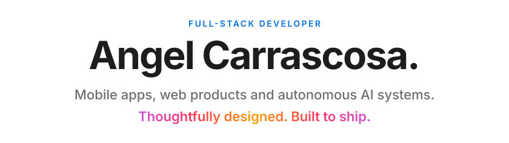
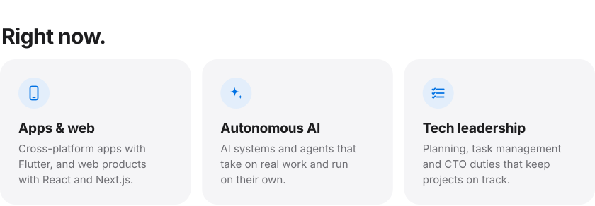
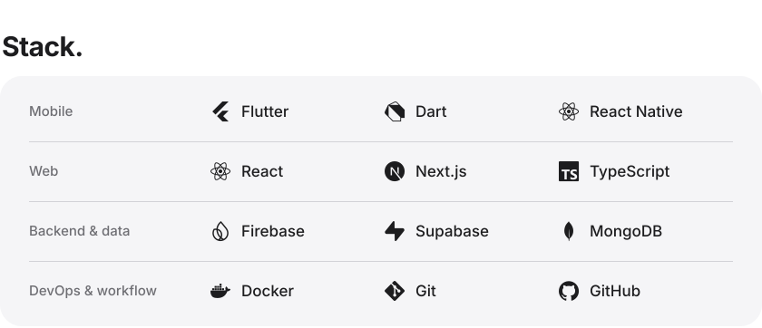
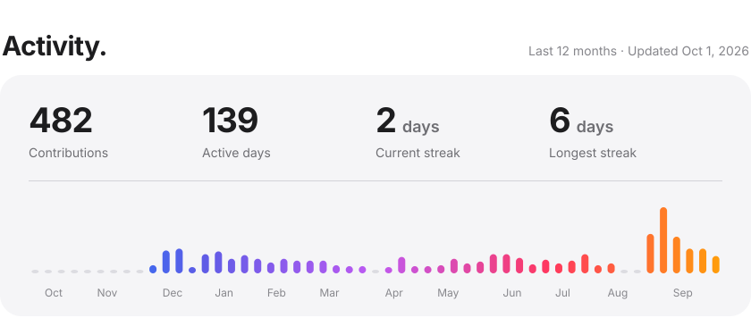

<picture>
  <source media="(prefers-color-scheme: dark)" srcset="assets/hero-dark.svg">
  
</picture>

<picture>
  <source media="(prefers-color-scheme: dark)" srcset="assets/now-dark.svg">
  
</picture>

<picture>
  <source media="(prefers-color-scheme: dark)" srcset="assets/stack-dark.svg">
  
</picture>

<picture>
  <source media="(prefers-color-scheme: dark)" srcset="assets/activity-dark.svg">
  
</picture>

 

  <a href="https://www.linkedin.com/in/angel-carrascosa-nombela-ab7b72151/">
    <picture>
      <source media="(prefers-color-scheme: dark)" srcset="assets/linkedin-dark.svg">
      
    </picture>
  </a>

